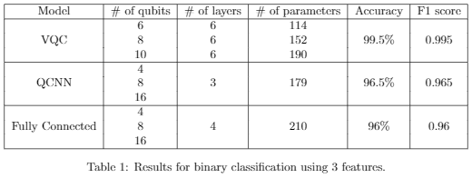

# Machine-Learning-Summer-Code
This is a repository containing code for my learning of classical and quantum machine learning, coming from the summer internship at the [QuDOS group](https://kyriienko.github.io/), University of Exeter.

Upon starting my masters project in quantum time crystals and learning about quantum computing, I have had the inspiration to learn about machine learning and its applications, specifically in quantum tech. Therefore, I have begun to understand and build my own ML models using both approaches. 

Classical models include a convolutional neural network for classification of the MNIST dataset using TensorFlow. Quantum models include a quantum kernel with support vector classification in Qiskit, a variational quantum classifier, quantum convolutional neural network and a fully connected quantum neural network using the [Yao Quantum](https://yaoquantum.org/) package for Julia. My goal is to compare performance of the three QML architectures on simple datasets.

## Models

* Variational Quantum Classifier

VQC is the simplest of the three architectures and an essential base for the following models. It relies on a feature map to encode classical data using parametrised rotations, followed by a fully-connected circuit shown above. Upon readout, we want to train the quantum neural network (QNN) to solve a classification task, as specified in a loss function. The variational parameters in the ansatz can be updated to minimize the loss using any classical optimization algorithm. Here I use the ansatz composed of multiple layers of parametrized rotations separate to each qubit followed by a ladder of CNOTs, and a final series of parametrized rotations (hardware-efficient ansatz). The number of layers can be changed to alter the number of parameters the circuit uses. Each qubit is then measured. The circuit is optimized using Yao's gradient evaluator based on automatic differentiation. Simple version of ADAM is used for optimization.

* Quantum Convolutional Neural Network

QCNN architecture is comprised of convolutional layers followed by pooling layers much like the classical counterpart. The convolutional layers contain two rows of two qubit unitaries which act on alternating pairs of qubits, composed of variational parameters. These unitaries are similar to that of the VQC but instead use a slightly different architecture that only acts on 2 neighbouring qubits.

The pooling layer contains measurements on half of the qubits with the outcome of the measurement controlling a unitary acting on the neighbouring qubit, in which a pooling operation of two qubits maps the 2 qubit Hilbert space to a 1 qubit Hilbert space. Each pooling layer is followed by a convolutional layer until the final Hilbert space of the system is sufficiently small and the output state of the circuit is measured by an operator.

In theory, the QCNN should have the best performance compared to that of the VQC and the fully connected models with the number of variational parameters being O(log(N)) for N qubits. With this and the circuits use of only nearest neighbour interactions therefore mean that the ansatz is hardware efficient.

The QCNN and fully connected circuits at the current time are not yet differentiable and instead use the LFBGS optimizer from [Optim.jl](https://github.com/JuliaNLSolvers/Optim.jl) and is numerically optimized.

The architecture used in the QCNN follows ideas from [arXiv:1810.03787v2](https://arxiv.org/pdf/1810.03787.pdf), [arXiv:2011.02966v1](https://arxiv.org/pdf/2011.02966.pdf), [arXiv:2108.00661v1](https://arxiv.org/pdf/2108.00661.pdf) and [arXiv:2009.09423v1](https://arxiv.org/pdf/2009.09423.pdf).

* Fully Connected Neural Network with no Pooling Layers

The fully connected model is essentially a QCNN without pooling layers and is instead completely composed of layers of the same two qubit unitaries as used in the QCNN, therefore keeping a constant input dimension throughtout the entire circuit.

## Results

The datasets used to benchmark the models can be found in the [datasets](datasets/) folder and include 2 feature, 3 feature, 5 feature and circular datasets.

The VQC unexpectedly has the best performance out of the three models, with the QCNN and Fully connected models having similar performance. The VQC uses automatic differentiation of quantum circuits for optimization which potentially offers a more accurate pathway for optimization and hence may be the reason why the VQC has a higher accuracy than the convolutional model. However, many machine learning models work better with certain datasets than others and since CNN's are widely used for image classification it would be good to encode some images into the circuit and measure the performance. Encoding such data however is tricky and is still an open topic.

Another improvement would be to make all models differentiable and use the same optimizer which would enable the best comparisons.
